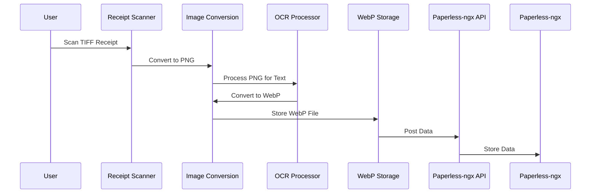

## Overview

**Purpose**: This feature automates the receipt processing workflow by scanning receipts, converting them to optimized formats, extracting data using OCR, and posting the data to Paperless-ngx. This streamlines the household ledger and purchase history tracking for users.

**Users**: Individuals who manually manage their receipts and want to automate the process.

**Impact**: Automates receipt processing, reducing manual effort and improving data accuracy.

### Goals

*   Automate receipt scanning and data extraction.
*   Optimize image formats for storage and processing.
*   Integrate seamlessly with Paperless-ngx.

### Non-Goals

*   Implementing advanced data analysis or reporting.
*   Supporting receipt processing for different languages besides English and Japanese.

## Architecture

### Existing Architecture Analysis

The existing system uses Python and the `requests` library to upload documents to Paperless-ngx. There are basic logging and error handling mechanisms in place. No explicit image processing services or file storage mechanisms are implemented beyond reading the input file.

### High-Level Architecture

```mermaid
graph TD
A[TIFF Receipt] --> B{Image Conversion (TIFF to PNG)}
B --> C{OCR Processing (PNG)}
C --> D{Image Conversion (PNG to WebP)}
D --> E{WebP Storage}
E --> F{Paperless-ngx API Integration}
F --> G[Paperless-ngx]
```

### Technology Alignment

The feature aligns with the existing technology stack by using Python, Pillow, and integrating with the Paperless-ngx API. No new dependencies are introduced.

## System Flows



## Components and Interfaces

### Image Processing

#### Image Conversion Service

**Responsibility & Boundaries**

*   **Primary Responsibility**: Convert images between different formats (TIFF to PNG, PNG to WebP).
*   **Domain Boundary**: Image processing.
*   **Data Ownership**: Manages the image data during conversion.
*   **Transaction Boundary**: Single image conversion.

**Dependencies**

*   **Inbound**: Receipt Scanner, OCR Processor.
*   **Outbound**: OCR Processor, WebP Storage.
*   **External**: Pillow library.

**External Dependencies Investigation**

*   Pillow library documentation: [https://pillow.readthedocs.io/en/stable/](https://pillow.readthedocs.io/en/stable/)

**Contract Definition**

```typescript
interface ImageConversionService {
  convertToPNG(tiffPath: string): Result<string, Error>;
  convertToWebP(pngPath: string): Result<string, Error>;
}
```

### OCR Processing

#### OCR Processor

**Responsibility & Boundaries**

*   **Primary Responsibility**: Extract text from PNG images using Paperless-ngx's OCR capabilities.
*   **Domain Boundary**: OCR processing.
*   **Data Ownership**: Manages the extracted text data.
*   **Transaction Boundary**: Single image OCR processing.

**Dependencies**

*   **Inbound**: Image Conversion Service.
*   **Outbound**: Paperless-ngx API Integration.
*   **External**: Paperless-ngx API.

**Contract Definition**

```typescript
interface OCRProcessor {
  processImage(pngPath: string): Result<string, Error>;
}
```

### Storage

#### WebP Storage Service

**Responsibility & Boundaries**

*   **Primary Responsibility**: Store WebP files in a structured directory.
*   **Domain Boundary**: File storage.
*   **Data Ownership**: Manages the WebP files.
*   **Transaction Boundary**: Single file storage.

**Dependencies**

*   **Inbound**: Image Conversion Service.
*   **Outbound**: None.
*   **External**: None.

**Contract Definition**

```typescript
interface WebPStorageService {
  storeFile(webpPath: string): Result<string, Error>;
}
```

### API Integration

#### Paperless-ngx API Integration Service

**Responsibility & Boundaries**

*   **Primary Responsibility**: Post extracted data to the Paperless-ngx REST API.
*   **Domain Boundary**: API integration.
*   **Data Ownership**: None.
*   **Transaction Boundary**: Single API request.

**Dependencies**

*   **Inbound**: OCR Processor.
*   **Outbound**: None.
*   **External**: Paperless-ngx API.

**Contract Definition**

```typescript
interface PaperlessNgxAPIService {
  postData(data: any): Result<string, Error>;
}
```

## Data Models

### Receipt Data

```typescript
interface ReceiptData {
  date: string;
  storeName: string;
  items: { name: string; amount: number }[];
  totalAmount: number;
}
```

## Error Handling

### Error Strategy

Concrete error handling patterns and recovery mechanisms for each error type.

### Error Categories and Responses

**User Errors** (4xx): Invalid input → field-level validation; Unauthorized → auth guidance; Not found → navigation help

**System Errors** (5xx): Infrastructure failures → graceful degradation; Timeouts → circuit breakers; Exhaustion → rate limiting

**Business Logic Errors** (422): Rule violations → condition explanations; State conflicts → transition guidance

## Testing Strategy

### Unit Tests

*   Image conversion functions.
*   OCR processing function.
*   WebP storage function.
*   API integration function.

### Integration Tests

*   Image conversion to OCR processing.
*   OCR processing to API integration.

### Security Considerations

*   The Paperless-ngx API key must be stored securely and should not be hardcoded in the code.
*   Implement appropriate input validation and sanitization to prevent security vulnerabilities.

Sources:
- [https://docs.paperless-ngx.com/api/](https://docs.paperless-ngx.com/api/)
- [https://pillow.readthedocs.io/en/stable/](https://pillow.readthedocs.io/en/stable/)
