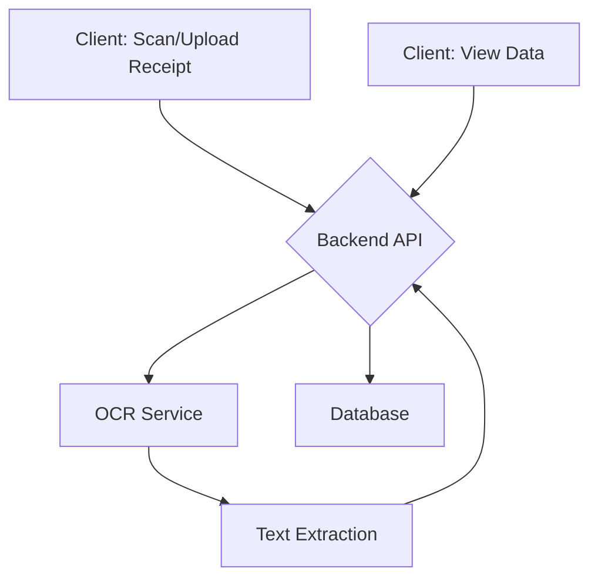

# Technology Stack

This document outlines the technology stack and architecture for the receipts system project, as inferred from the project description.

## High-Level Architecture

The system follows a client-server model. A client application (e.g., mobile or web) captures and uploads a receipt image. A backend service receives the image, processes it through an OCR engine, structures the extracted data, and saves it to a database. The client can then request and display this data in a structured format.

## Components & Technologies

- **Frontend (Client)**: A web or mobile application.
  - **Framework (Assumed)**: React, Vue, Svelte, or a native mobile framework.
- **Backend (Server)**: A server application to handle API requests, business logic, and data processing.
  - **Language (Assumed)**: Python (with Django/Flask) or Node.js (with Express) are suitable choices.
- **OCR Engine**: A service or library for optical character recognition.
  - **Options**: Tesseract, Google Cloud Vision API, AWS Textract.
- **Database**: A database to store user data, receipt information, and extracted text.
  - **Options**: PostgreSQL for structured data, or MongoDB for more flexible schema.
- **Development Environment**:
  - **Package Management**: `npm` for frontend, `pip` for Python backend.

## Common Commands

- `npm install`: Install frontend dependencies.
- `npm start`: Run the frontend development server.
- `pip install -r requirements.txt`: Install Python backend dependencies.
- `python main.py`: Run the backend server.
