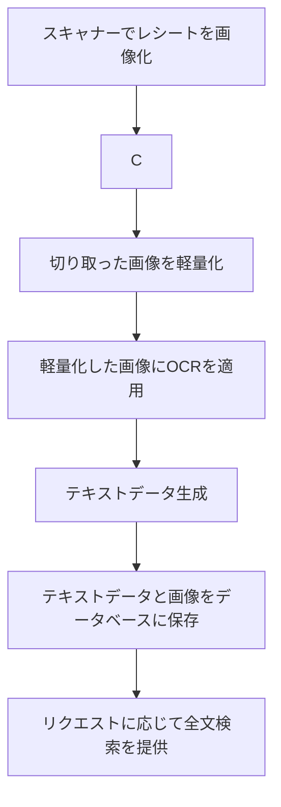

## プロジェクト概要

このプロジェクトは、**スキャンした領収書をOCR（光学文字認識）技術で自動的に読み取り、家計簿として管理するだけでなく、過去の購買履歴や日々の行動を記録・分析するためのスマートなライフログシステム**を構築することを目指しています。単なる支出管理ツールを超え、あなたの消費パターンや行動傾向を可視化し、より賢い意思決定をサポートします。

## 主な機能

  * ### 高精度OCRによる領収書読み取り

    スマートフォンで撮影またはスキャンした領収書から、日付、店名、品目、金額などを高精度で抽出します。表記ゆれの吸収や、認識エラーの自動修正機能も導入予定です。

  * ### 自動家計簿生成

    抽出された情報を基に、自動的に家計簿のカテゴリ（食費、交通費など）に分類して記録します。ユーザーによるカスタマイズや手動修正も可能です。

  * ### 購買履歴の自動記録と分析

      * **店舗別・品目別履歴**: 特定のスーパーで「いつ、何を、いくらで買ったか」を時系列で追跡。過去の価格と比較することで、商品の値動きを把握できます。
      * **価格変動の可視化**: よく購入する商品の価格推移をグラフで表示し、最適な購入タイミングをサポートします。

  * ### 行動ログとの連携

      * **位置情報（GPS）連携**: 領収書発行時の位置情報を自動で記録し、「いつ、どこで何を購入したか」を地図上で可視化。これにより、あなたの行動範囲や滞在場所を把握できます。
      * **カレンダー連携**: 購買履歴や行動履歴をカレンダー形式で表示し、日々の活動を俯瞰できます。

  * ### 詳細な分析・可視化

      * **支出分析**: 月ごと、カテゴリごとの支出をグラフで表示し、支出傾向を把握。予算設定機能と連携し、使いすぎを防止します。
      * **行動パターンの分析**: 訪問頻度の高い場所や、特定の曜日・時間帯の行動傾向を自動で分析します。

  * ### クラウド同期とデータ管理

    複数のデバイス間でデータをシームレスに同期し、安全にバックアップ・復元できる機能を備えます。

## こんな方におすすめ

  * **家計簿をつけるのが面倒だと感じている方**: 領収書を撮るだけで自動的に家計簿が完成します。
  * **自分の消費傾向を把握したい方**: 何にいくら使っているか、どのスーパーのどの商品が安いかなどを簡単に確認できます。
  * **過去の行動や思い出を記録したい方**: 買い物履歴や訪問場所から、日々のライフスタイルを振り返ることができます。
  * **より賢くお金を使いたい方**: 商品の価格変動を把握し、特売日を狙って買い物をしたい方。

## フロー

